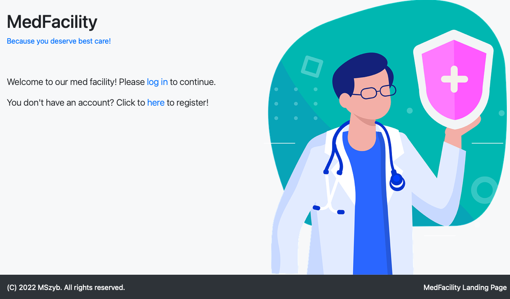
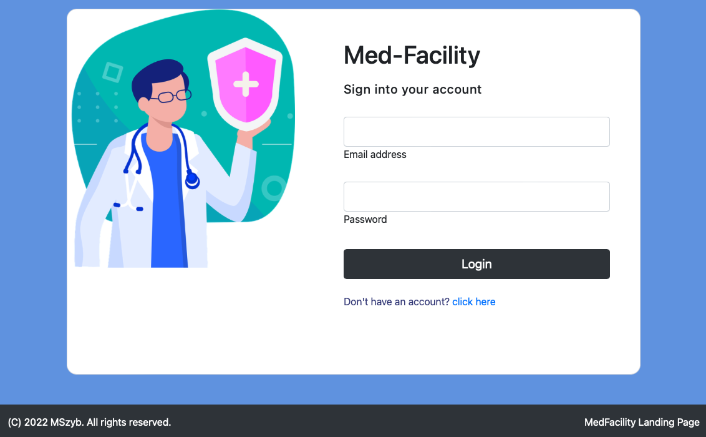
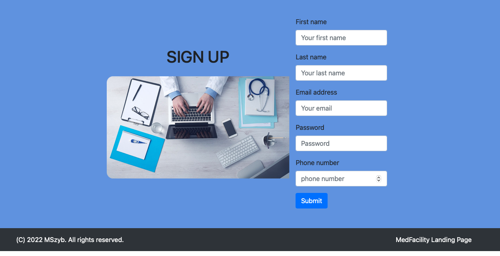
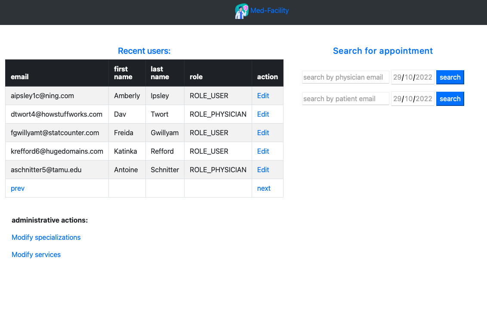
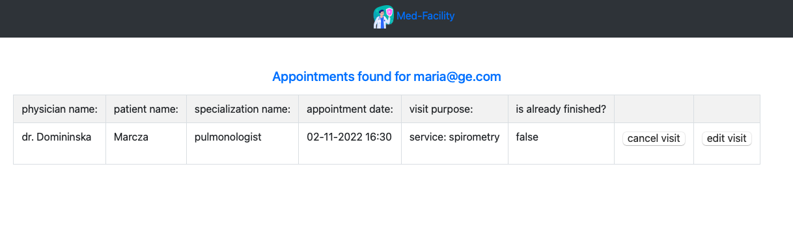
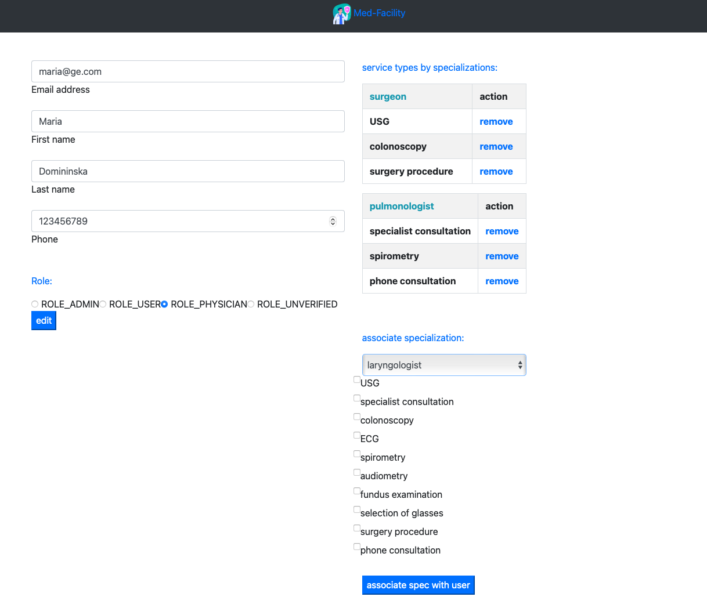
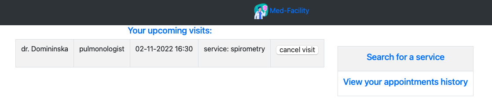
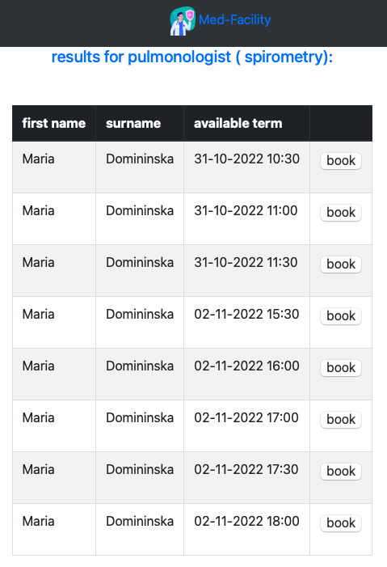
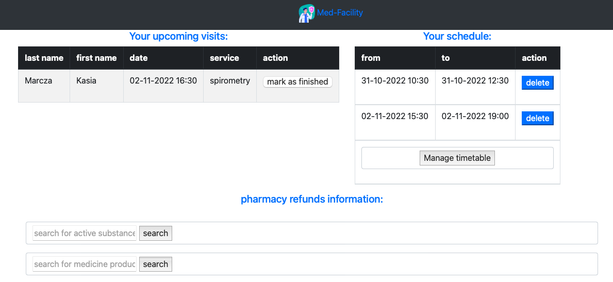
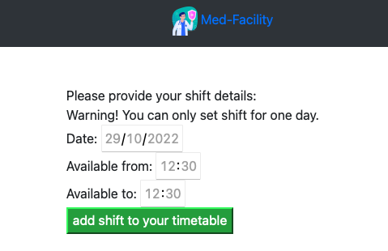

# General info

This project provides functional app for administrators, physicians and patients of hypothetical medical facility. 
## Purpose
Project was build as a final project for Java Coders Lab course.

## Technologies
- Java 18
- Maven
- Spring Boot
- Spring Security
- Hibernate
- MySQL
- BCrypt
- Jackson
- Lombok
- Mockito
- Thymeleaf

## Main functionalities
Not authorized users are capable of accessing only main page, logging page and registration page. Authentication is managed by Spring Security.

After creating an account, activation link is sent from email provided in application.properties to an email address provided during registration. Before accessing this link account is consider as not-activated.

Users are basically divided into 3 roles: USER, PHYSICIAN and ADMIN. 
Program delivers various functionalities, depending on user role: 

NOT AUTHORIZED:
- account registration 
- logging

USER:
- searching for a medical service
- making an appointment 
- viewing appointment history 

PHYSICIAN: 
- viewing schedule
- managing timetable (availability)
- viewing upcoming visits
- marking visit as finished 
- viewing appointment history 
- searching for an active substances and medicines names. This functionality is realized by querying NFZ API (https://api.nfz.gov.pl)

ADMINISTRATOR: 
- editing users information
- assigning roles to users 
- assigning specializations and services to physicians 
- canceling and editing appointments 
- adding new medical specializations and services 
- activating and deactivating medical specializations and services

## Getting started
Program was designed to work with relational databases like MySQL. 
App need some additional configuration data to work properly. As indicated in application.properties
>spring.config.import=dev.properties

spring configuration information need to be included in the file dev.properties in a format as below:

>MYSQLDB_URL= \
MYSQLDB_USER= \
MYSQLDB_ROOT_PASSWORD= \
MYSQLDB_TEST_DATA= \
MAIL_HOST= \
MAIL_PORT= \
MAIL_USERNAME= \
MAIL_PASSWORD= 

## Screenshots
- main page

- loggin page

- registration page

- admin dashboard

- admin appointment search result

- admin physician edition page

- user main page

- user service search result

- physician main page

- physician timetable adding page

